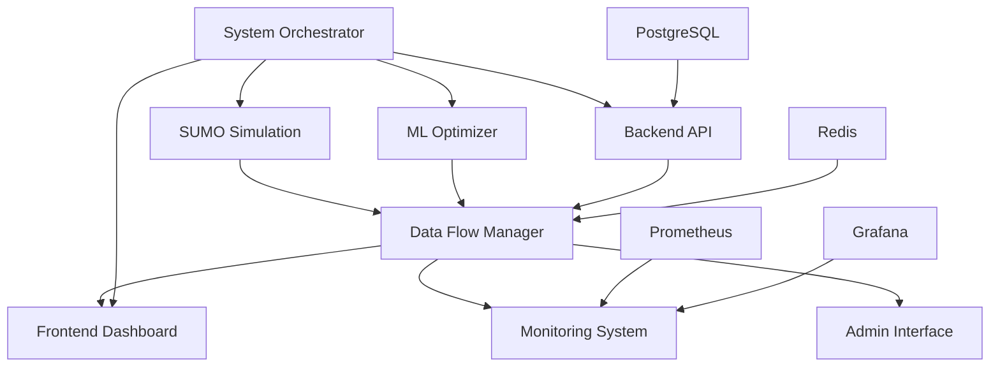
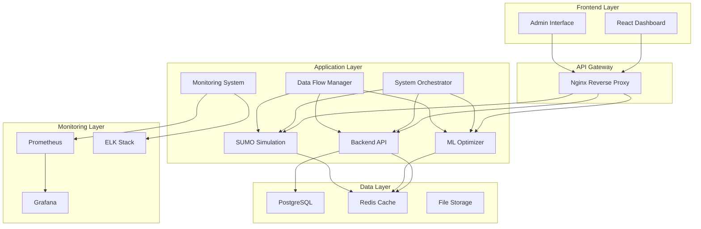

# Smart Traffic Management System Architecture

## Overview

The Smart Traffic Management System is a comprehensive, real-time traffic control and optimization platform that integrates multiple components to provide intelligent traffic management capabilities.

## System Components

### 1. Backend API Service
- **Technology**: FastAPI (Python)
- **Port**: 8000
- **Purpose**: Core API service handling traffic data, user management, and system coordination
- **Key Features**:
  - RESTful API endpoints
  - Real-time WebSocket connections
  - Database management (PostgreSQL)
  - Authentication and authorization
  - Data validation and processing

### 2. ML Optimizer Service
- **Technology**: Python with scikit-learn, TensorFlow
- **Port**: 8001
- **Purpose**: Machine learning-based traffic optimization
- **Key Features**:
  - Q-learning optimization
  - Dynamic programming algorithms
  - Webster's formula implementation
  - Real-time traffic pattern analysis
  - Performance metrics calculation

### 3. SUMO Simulation Service
- **Technology**: Python with SUMO (Simulation of Urban MObility)
- **Port**: 8002
- **Purpose**: Traffic simulation and scenario testing
- **Key Features**:
  - Real-time traffic simulation
  - Vehicle behavior modeling
  - Traffic light control simulation
  - Performance data collection
  - Scenario management

### 4. Frontend Dashboard
- **Technology**: React with TypeScript, SAP UI5 Web Components
- **Port**: 3000
- **Purpose**: User interface for traffic management
- **Key Features**:
  - Real-time dashboard
  - Interactive traffic visualizations
  - Traffic light control interface
  - Analytics and reporting
  - Responsive design

### 5. System Orchestrator
- **Technology**: Python asyncio
- **Purpose**: System coordination and management
- **Key Features**:
  - Component lifecycle management
  - Health monitoring
  - Automatic restart and recovery
  - Configuration management
  - System status reporting

### 6. Data Flow Manager
- **Technology**: Python with Redis/RabbitMQ
- **Purpose**: Real-time data pipeline management
- **Key Features**:
  - Message queue management
  - Data transformation
  - Event-driven architecture
  - Data validation
  - Performance optimization

### 7. Monitoring System
- **Technology**: Python with Prometheus, Grafana
- **Purpose**: System monitoring and observability
- **Key Features**:
  - Health checks
  - Metrics collection
  - Alerting system
  - Performance monitoring
  - Log aggregation

### 8. Admin Interface
- **Technology**: FastAPI with HTML templates
- **Port**: 8003
- **Purpose**: System administration and management
- **Key Features**:
  - Component management
  - Configuration updates
  - Alert management
  - System monitoring
  - User management

## Data Flow Architecture

## System Architecture Diagram

## Component Communication

### 1. RESTful APIs
- All services expose RESTful APIs for communication
- Standard HTTP methods (GET, POST, PUT, DELETE)
- JSON data format
- Authentication via JWT tokens

### 2. WebSocket Connections
- Real-time data streaming
- Bidirectional communication
- Event-driven updates
- Connection management

### 3. Message Queues
- Redis for caching and pub/sub
- RabbitMQ for reliable messaging
- Kafka for high-throughput data streams
- Event-driven architecture

### 4. Database Connections
- PostgreSQL for persistent data
- Redis for caching and sessions
- Connection pooling
- Transaction management

## Security Architecture

### 1. Authentication
- JWT-based authentication
- Role-based access control (RBAC)
- Multi-factor authentication support
- Session management

### 2. Authorization
- API endpoint protection
- Resource-level permissions
- Admin interface access control
- Component isolation

### 3. Data Security
- Encryption in transit (HTTPS/TLS)
- Encryption at rest
- Data validation and sanitization
- Audit logging

### 4. Network Security
- Firewall configuration
- VPN access for admin functions
- Network segmentation
- Intrusion detection

## Deployment Architecture

### 1. Containerization
- Docker containers for all services
- Multi-stage builds for optimization
- Health checks and monitoring
- Resource limits and constraints

### 2. Orchestration
- Docker Compose for local development
- Kubernetes for production deployment
- Service discovery and load balancing
- Auto-scaling capabilities

### 3. CI/CD Pipeline
- GitHub Actions for automation
- Automated testing and validation
- Security scanning
- Blue-green deployments

### 4. Monitoring and Logging
- Centralized logging with ELK stack
- Metrics collection with Prometheus
- Visualization with Grafana
- Alerting and notification

## Performance Considerations

### 1. Scalability
- Horizontal scaling capabilities
- Load balancing
- Database sharding
- Caching strategies

### 2. Reliability
- Health checks and monitoring
- Automatic restart and recovery
- Circuit breakers
- Graceful degradation

### 3. Performance
- Connection pooling
- Caching layers
- Asynchronous processing
- Resource optimization

### 4. Availability
- High availability setup
- Backup and recovery
- Disaster recovery procedures
- Maintenance windows

## Configuration Management

### 1. Environment Configuration
- Environment-specific configs
- Secret management
- Configuration validation
- Hot reloading

### 2. Service Discovery
- Dynamic service registration
- Health check integration
- Load balancer configuration
- Failover mechanisms

### 3. Monitoring Configuration
- Alert thresholds
- Metrics collection intervals
- Log levels and retention
- Dashboard configurations

## Development and Testing

### 1. Development Environment
- Local development setup
- Docker Compose for services
- Hot reloading
- Debugging tools

### 2. Testing Strategy
- Unit testing
- Integration testing
- End-to-end testing
- Performance testing

### 3. Quality Assurance
- Code quality checks
- Security scanning
- Performance monitoring
- Documentation

## Maintenance and Operations

### 1. System Monitoring
- Real-time monitoring
- Performance metrics
- Health checks
- Alert management

### 2. Log Management
- Centralized logging
- Log aggregation
- Search and analysis
- Retention policies

### 3. Backup and Recovery
- Automated backups
- Point-in-time recovery
- Disaster recovery
- Data integrity checks

### 4. Updates and Patches
- Rolling updates
- Zero-downtime deployments
- Rollback procedures
- Change management

## Future Enhancements

### 1. Scalability Improvements
- Microservices architecture
- Service mesh implementation
- Advanced caching strategies
- Database optimization

### 2. Feature Enhancements
- Advanced ML algorithms
- Real-time analytics
- Mobile applications
- IoT integration

### 3. Performance Optimizations
- GPU acceleration
- Edge computing
- Advanced monitoring
- Predictive scaling

### 4. Security Enhancements
- Zero-trust architecture
- Advanced threat detection
- Compliance frameworks
- Security automation
